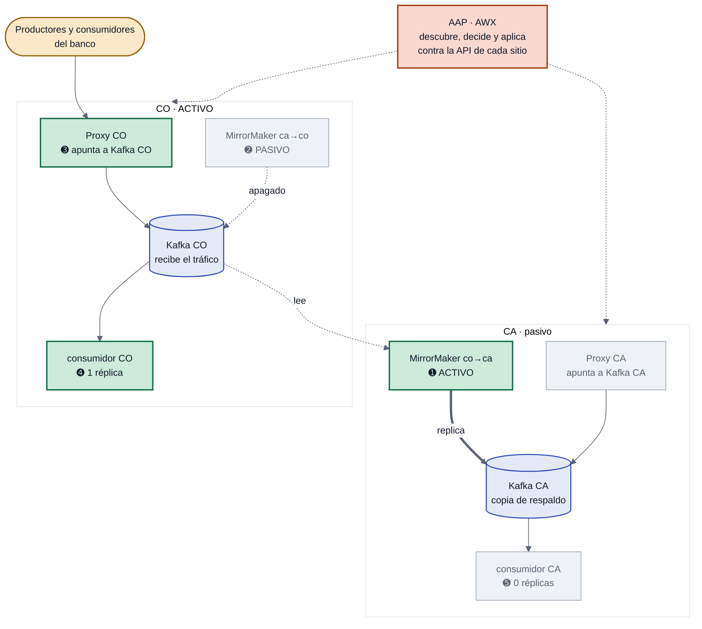
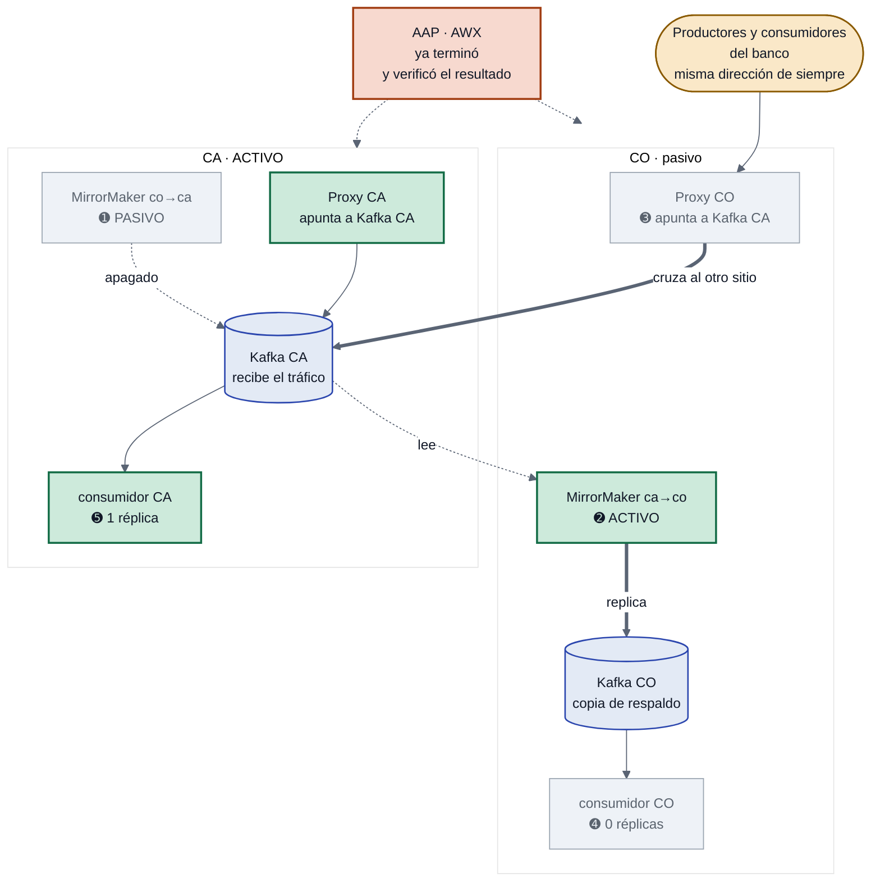
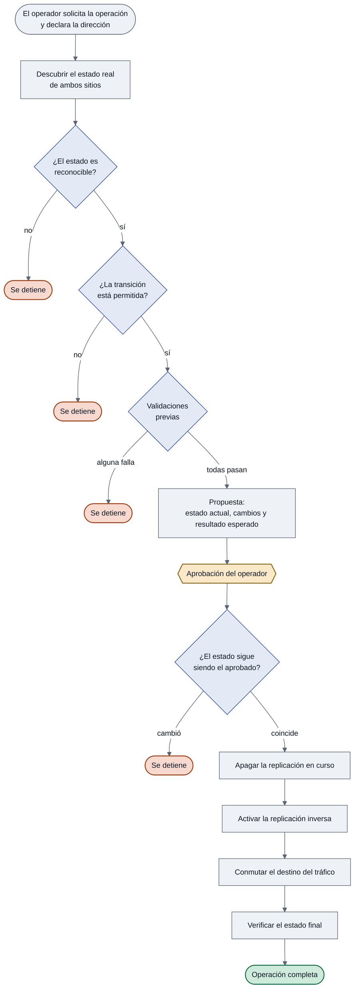

# Automatización de Rotación — Kafka Activo/Pasivo

Automatiza en Ansible Automation Platform la **rotación de roles** entre los dos sitios de un
clúster Kafka activo/pasivo sobre OpenShift: invierte la replicación de MirrorMaker 2, conmuta
el tráfico hacia el sitio que asume la operación y ajusta las aplicaciones de cada sitio a su
nuevo rol. Es la inversión planificada, con **los dos sitios sanos**.

La decisión de ejecutarla sigue siendo del operador. Lo que se automatiza es todo lo demás:
establecer el estado real, verificar que la operación sea posible, aplicarla en el orden correcto
y confirmar el resultado.

> El **failover por caída** del sitio activo es otra operación, con otro estado final, y no está
> implementada. Pedirla se detiene sin tocar nada. Ver [Alcance](#alcance).

---

## El ambiente

La unidad es una **pareja**: dos sitios con un Kafka cada uno, replicación entre ellos, un proxy
por sitio y las aplicaciones que siguen el rol de su sitio. Así se ve en reposo, con CO activo.



En verde, lo que está encendido o sirviendo tráfico ahora. En gris, lo que está en reposo
esperando su turno. Las líneas punteadas desde AAP son las únicas que representan a la
automatización: **no se interpone en el camino del dato**, solo lee y modifica configuración
a través de la API de OpenShift de cada sitio.

### Lo que hay que leer de ahí

**El MirrorMaker vive en el sitio destino, no en el origen.** El que replica de CO hacia CA
—el que está encendido— está dibujado dentro de CA. Lee del Kafka de CO y escribe en el de CA.
Es la asimetría más importante del diseño y la que más confusión genera: *el que trabaja no está
donde nace el dato, está donde el dato llega*.

**El sitio activo se deduce de ahí.** No está configurado en ninguna parte: activo es aquel
desde el cual se está replicando.

**El destino del proxy no sirve para saber quién está activo.** Para eso se mira qué MirrorMaker
está encendido: el que replica *desde* el activo.

### Lo que la rotación cambia, en ese orden

Las acciones del contrato, en el orden en que se aplican:

| | Qué cambia | Por qué en ese momento |
|---|---|---|
| ➊ | `co→ca` pasa a **PASIVO** | Primero se apaga la replicación en curso |
| ➋ | `ca→co` pasa a **ACTIVO** | Recién entonces se enciende la inversa. Las dos a la vez harían circular los mensajes entre sitios |
| ➌ | El proxy de CO pasa a apuntar al **Kafka de CA** | Los clientes conservan su dirección y pasan a ser servidos por CA |
| ➍ | El proxy de CA pasa a apuntar al **Kafka de CA** | **Los dos proxies terminan en el sitio activo.** Quien entre por cualquiera de los dos llega a los datos que mandan |
| ➎ | El consumidor de CO baja a **0 réplicas** | Primero se detiene el que deja de ser activo |
| ➏ | El consumidor de CA sube a **1 réplica** | Recién entonces se levanta el que asume. Los dos arriba se pelearían las particiones |

La ➍ parece redundante en la primera rotación, porque el proxy de CA ya apunta a su propio Kafka.
Importa en la siguiente: sin ella, el proxy del sitio que vuelve a ser activo se queda apuntando
al otro, y quien entre por ahí termina atendido contra el clúster pasivo. Al terminar, la
verificación **exige** que los dos lleven al activo.

### Así queda al terminar



Es el mismo dibujo con los colores cambiados de lado. CO sigue arriba y CA abajo, y cada pieza
en el mismo lugar, para que la comparación sea directa. Tres detalles que vale mirar:

**Los clientes entran por el mismo lugar.** Siguen llegando al proxy de CO, con la misma
dirección de siempre. Lo que cambió es a dónde los manda ese proxy: ahora cruza al Kafka de CA.
Por eso del lado del banco no hay que reconfigurar nada.

**El copión se dio vuelta.** Ahora el que trabaja es el que vive en CO y lee desde CA. Sigue
cumpliéndose la regla: el que copia vive en el sitio al que llegan los datos.

**El proxy de CA no se tocó.** Sigue apuntando a su propio Kafka, que ahora es el activo, así
que está bien. Devolver el proxy de CO a su sitio es trabajo del failback.


---

## Cómo opera



### Las etapas

| | Etapa | Qué ocurre |
|---|---|---|
| 1 | **Descubrir** | Se consulta el estado real de los dos sitios: cuál está activo, en qué estado está cada MirrorMaker, hacia dónde apunta el tráfico y cuánto atraso acumula la replicación. Nada se da por supuesto. |
| 2 | **Reconocer** | El estado encontrado debe corresponder a una situación conocida. Señales contradictorias —dos replicaciones activas a la vez, un sitio que no responde, un conector caído— interrumpen la operación. |
| 3 | **Validar la transición** | La operación solicitada debe estar permitida desde el estado actual. El conjunto de transiciones válidas es explícito y acotado. |
| 4 | **Validaciones previas** | Se comprueban las condiciones necesarias para que la operación pueda completarse: que la dirección declarada por el operador sea la que el descubrimiento encontró, la salud del sitio destino, el estado de la replicación y la alcanzabilidad del destino del tráfico. |
| 5 | **Proponer** | Se presenta al operador qué se encontró, qué cambios se aplicarán y cómo quedará el ambiente. |
| 6 | **Aprobar** | El flujo se detiene. Hasta aquí no se modificó nada. |
| 7 | **Revalidar** | Antes de la primera escritura se vuelve a establecer el estado y se comprueba que siga coincidiendo con lo aprobado. |
| 8 | **Ejecutar** | Se apaga la replicación en curso, se activa la inversa y se conmuta el destino del tráfico. En ese orden. |
| 9 | **Verificar** | Se confirma que el estado alcanzado es el que la transición declaraba. |

Las etapas 1 a 6 no modifican el ambiente. La primera escritura ocurre en la 8.

---

## Principios

Dos propiedades sostienen el diseño:

**No se asume quién es el sitio activo.** Se descubre en cada ejecución, a partir de qué
MirrorMaker está replicando. Tras una rotación de roles los sitios quedan invertidos de forma
permanente, y la automatización lo refleja sin cambios de configuración.

**Ante un estado que no reconoce, se detiene.** No interpreta, no corrige, no improvisa. El
conjunto de transiciones válidas es explícito; cualquier combinación fuera de él interrumpe la
operación.

---

## Alcance

La unidad sobre la que opera es una **pareja**: dos clústeres Kafka en sitios opuestos, con sus
dos MirrorMaker y su proxy.

| | |
|---|---|
| **Implementado** | `rotacion` — inversión de roles de una pareja, **con los dos sitios alcanzables**, en cualquiera de las dos direcciones |
| **No implementado** | `failover` por caída del sitio activo. Pedirlo se detiene sin tocar nada |
| **Previsto** | Failback con resincronización, y parejas adicionales |

Incorporar una pareja adicional es agregar un bloque de datos: la automatización no contiene
referencias a ninguna pareja en particular. Incorporar una operación es agregar un bloque a
`transitions.yml`: ningún rol bifurca por el nombre de la operación.

### Por qué el sitio caído es otra operación

La rotación conmuta la operación entre dos sitios que responden. **Cuatro de sus seis acciones
escriben en el sitio que deja de ser activo**: invertir su MirrorMaker, conmutar su proxy y
detener sus aplicaciones.

Con el sitio activo realmente caído, tres de esas cuatro son imposibles, no solo riesgosas:

- El MirrorMaker que habría que **encender** replica *hacia* el sitio caído, y guarda su propio
  estado en el Kafka de ese sitio. No se puede replicar hacia un Kafka que no está, viva donde
  viva el MirrorMaker.
- El proxy que habría que conmutar **vive en el sitio caído**.
- Las aplicaciones que habría que detener también.

Y la verificación tampoco se sostiene: exige que la replicación esté al día sobre los dos sitios,
y un sitio que no responde no se puede medir. Afirmar que no se perdió nada sería afirmarlo sin
evidencia.

Un sitio caído no es, entonces, el mismo escenario con una validación relajada: es una transición
distinta, con otro estado final, que implica aceptar que durante la contingencia no hay
replicación de vuelta. Eso es una decisión de negocio, no de implementación. Mientras no esté
tomada, `failover` no tiene transición declarada y pedirlo se detiene sin modificar nada.

---

## Estructura

```
transitions.yml          contrato de transiciones permitidas
inventory/
  hosts.ini
playbooks/
  discover.yml           consulta el estado, sin modificar nada
  preflight.yml          valida la operación y arma la propuesta
  aplicar.yml            ejecuta el plan aprobado y verifica
  group_vars/all/
    parejas.yml          definición de cada pareja
    umbrales.yml         tolerancias y tiempos de espera
roles/
  kafka_discover/        establece el estado real de ambos sitios
  kafka_decide/          valida contra el contrato; propone o verifica
  mm2_state/             modifica el estado de un MirrorMaker
  proxy_target/          conmuta el destino del tráfico
  app_scale/             ajusta las aplicaciones al rol de su sitio
```

De los cinco roles, **tres modifican el ambiente**. Los otros dos consultan y calculan.

---

## Los roles

Cada rol es una capacidad acotada que recibe una pareja y actúa sobre ella. Ninguno contiene
referencias a una pareja concreta: eso vive en los datos.

### `kafka_discover` — establece el estado real

Consulta los dos sitios y construye una representación única del ambiente: qué sitio está
activo, en qué estado se encuentra cada MirrorMaker, hacia dónde apunta el tráfico, si los
destinos configurados son alcanzables, y cuánto atraso acumula la replicación medido por
partición.

El sitio activo **se deduce**, no se configura: es aquel desde el cual se está replicando.

Es la única pieza que consulta ambos sitios a la vez, y la que alimenta a todas las demás. Si un
sitio no responde, lo reporta como tal en lugar de fallar — distinguir *"no existe"* de *"no
pude consultarlo"* es necesario para decidir correctamente.

**No modifica nada.**

### `kafka_decide` — contrasta contra el contrato

Busca en `transitions.yml` la transición que corresponde a la operación solicitada desde el
estado encontrado. Si no existe, interrumpe.

Opera en dos momentos:

| Momento | Qué hace |
|---|---|
| Antes de ejecutar | Corre las validaciones previas y arma el plan: qué recursos se tocarán, con qué valores y cuál es el resultado esperado |
| Después de ejecutar | Compara el estado alcanzado contra el que la transición declaraba, y contrasta los datos: que no falten particiones, que no se hayan perdido mensajes y que los consumidores conserven su posición |

**No modifica nada.** Decide si se puede avanzar y qué debe ocurrir; la ejecución es de otros.

### `mm2_state` — cambia el estado de la replicación

Lleva cada MirrorMaker al estado que el plan indica. El cambio es declarativo: se ajusta la
configuración existente, no se eliminan ni recrean recursos.

Respeta el orden del plan, que no es arbitrario: **primero se detiene la replicación en curso y
después se activa la inversa.** Tenerlas activas simultáneamente haría que los mensajes
circulen entre sitios indefinidamente.

Tras cada cambio espera a que el recurso quede efectivamente aplicado antes de continuar.

### `proxy_target` — conmuta el destino del tráfico

Cambia el destino al que el proxy dirige a los productores y consumidores. Recorre **todos** los
proxies que el plan nombre: con uno por sitio, la rotación conmuta el del sitio que sale y el del
que llega, para que los dos terminen en el sitio activo.

Antes de tocar nada verifica que el destino sea alcanzable. Es la validación que evita el modo
de falla más costoso: cortar el tráfico del origen y descubrir después que el destino no estaba
disponible.

### `app_scale` — ajusta las aplicaciones al rol de su sitio

Lleva cada aplicación declarada al número de instancias que corresponde al rol que su sitio
pasa a tener. Respeta el orden del plan: **primero se detienen las del sitio que deja de ser
activo**, después se levantan las del que asume. Evita que ambas procesen a la vez.

Qué aplicaciones siguen el rol del sitio es una decisión del ambiente, declarada en los datos.
Los sistemas que conmutan por su cuenta quedan fuera.

---

## Configuración

Dos archivos concentran todo lo que cambia entre ambientes. Los roles no contienen nombres de
recursos ni rutas.

### `parejas.yml` — qué existe y dónde

Por cada pareja: los dos sitios con su API, namespace y nombre de clúster; los dos MirrorMaker
con el sitio donde reside cada uno; el proxy y sus destinos posibles; los tópicos de aplicación
y los grupos de consumo que se vigilan; y las aplicaciones que siguen el rol de su sitio.

El MirrorMaker reside siempre en el sitio **destino** de la replicación, no en el origen.

No se declaran nombres de pods. El broker al que se consultan los offsets se elige por etiqueta
entre los que están corriendo: un nombre fijo se desactualiza en silencio cuando el clúster se
recrea, y la medición quedaría vacía sin que nada lo señale.

### `transitions.yml` — qué está permitido

Por cada transición: el estado de partida, las validaciones exigidas, las acciones a aplicar y
el estado esperado al terminar. Una transición no declarada aquí no puede ejecutarse.

Es el documento que se revisa con arquitectura y con auditoría: describe el comportamiento
completo de la automatización sin leer código.

### `umbrales.yml` — tolerancias

Atraso de replicación admitido, tiempos de espera y condiciones de salud exigidas. Ajustables
por ambiente sin tocar la lógica.

---

## Validaciones previas

La transición declara cuáles exige. Si alguna falla, no se modifica nada.

| Validación | Qué exige |
|---|---|
| Sitio destino alcanzable | su API responde |
| Kafka destino operativo | el clúster reporta estado correcto |
| Sin particiones sub-replicadas | el destino está íntegro |
| Replicación al día | el atraso no supera el umbral configurado |
| Posición de los consumidores replicada | el sitio que asume no reprocesa desde el principio |
| Destino de tráfico resoluble | la configuración del proxy apunta a un destino válido |

Dos merecen explicación. La de **posición de los consumidores** existe porque los mensajes y la
posición de lectura son dos flujos distintos: pueden estar los datos y no estar el marcador, y
entonces el sitio que asume reprocesa. La de **destino de tráfico** evita el modo de falla más
costoso: cortar el tráfico y descubrir después que el destino no era alcanzable.

Las validaciones que comparan ambos sitios exigen además haber podido medirlos. Una validación
sin datos no se da por superada.

---

## Operación en AAP

El flujo se ejecuta como un workflow de tres pasos: **validación → aprobación → ejecución**.

El operador declara su intención — qué pareja, qué operación y **qué sitio quiere dejar activo**.
La dirección no describe una maniobra, describe el estado deseado. De ahí salen tres respuestas
posibles:

| Lo que el operador pide | Lo que encuentra la automatización | Respuesta |
|---|---|---|
| Dejar activo al otro sitio | el estado de partida de una transición válida | propone la maniobra y pide aprobación |
| Dejar activo al sitio que ya lo es | un estado coherente | **nada que hacer**: lo informa y no modifica nada |
| Dejar activo al sitio que ya lo es | un estado incoherente | se detiene: el sitio correcto puede estar activo con la replicación o el tráfico a medio camino, y eso necesita una persona |

Que pedir un destino al que ya se llegó no sea un error hace la operación repetible: relanzarla
tras una ejecución completa informa que no hay nada que hacer, en lugar de proponer la maniobra
inversa. Sin la dirección declarada, la misma plantilla ejecutaba hacia un lado o hacia el otro
según un estado que el operador no veía hasta tenerlo ya propuesto, y una aprobación dada por
costumbre bastaba para conmutar al revés.

Antes de aprobar, el operador recibe el estado encontrado, los cambios que se aplicarán y el
resultado esperado.

El plan aprobado acompaña a la ejecución. Antes de modificar nada, la automatización vuelve a
establecer el estado y **comprueba que siga coincidiendo con lo aprobado**. Nunca ejecuta el plan
aprobado sobre un estado distinto del que el operador vio, y distingue dos casos:

- Si el sitio que se pidió dejar activo **ya lo es**, el objetivo está cumplido. Lo informa, no
  modifica nada y **termina correctamente**: llegar al estado deseado no es un error.
- Si el ambiente quedó en cualquier **otra** situación, se detiene con error, porque está en un
  estado que nadie aprobó.

El plan también lleva la **versión del código** que lo produjo. El proyecto se sincroniza antes de
cada plantilla, así que un cambio publicado mientras el operador decide haría que se ejecute con
código que nadie revisó. Si la versión no coincide, la ejecución se detiene: la aprobación
autoriza un plan, y ese plan lo produjo una versión concreta.

### Objetos requeridos

| Objeto | Función |
|---|---|
| Proyecto | Apunta a este repositorio. Conviene sincronizarlo al lanzar, para que cada ejecución use la versión vigente |
| Inventario | Un único `localhost`. La automatización corre desde el entorno de ejecución contra las APIs de los clústeres; no hay hosts remotos |
| Tipo de credencial | Entrega el acceso a cada sitio. **Su creación requiere privilegios de superusuario** en la plataforma; no alcanza con administrar la organización |
| Credencial | Una por conjunto de sitios, construida sobre el tipo anterior |
| Plantillas de trabajo | Tres: consulta de estado, validación y ejecución |
| Flujo de trabajo | Uno por operación: validación → aprobación → ejecución |

Las tres plantillas son genéricas: no contienen la operación ni la pareja. Esos valores llegan
desde el flujo.

### Configuración que la solución requiere

Más allá de crear los objetos, estas condiciones sostienen las garantías de la sección final.
Sin ellas la automatización sigue funcionando, pero deja de ser confiable.

**El flujo de trabajo es la única puerta de entrada.** El formulario que responde el operador
vive ahí, no en las plantillas. Replicarlo en ambos lugares abre la posibilidad de que queden
desalineados y que el comportamiento dependa de por dónde se entre.

**Cada valor tiene un solo origen.** Lo que el operador elige llega por el formulario; lo que
define el contexto de ejecución vive en la plantilla correspondiente; lo que configura el
comportamiento de la solución vive en este repositorio. Un mismo valor definido en dos lugares
vuelve indeterminado cuál gana.

**La inyección libre de variables debe estar deshabilitada** en el flujo y en todo lo que
ejecute. De lo contrario, quien lanza puede sobrescribir los umbrales que gobiernan las
validaciones previas y atravesarlas sin que quede constancia de que se saltearon.

La consecuencia es deliberada: **los parámetros que gobiernan el comportamiento solo se cambian
en el repositorio**, con revisión y trazabilidad. La pregunta *"¿con qué parámetros se ejecutó
esta operación?"* tiene una única respuesta posible, y está versionada.

**La ejecución declara que opera bajo aprobación.** La plantilla que modifica el ambiente lleva
esa condición fijada: si se la invoca sin el plan aprobado, se detiene en lugar de continuar
sin esa validación.

---

## Nota sobre la versión de la API de MirrorMaker

Los recursos `KafkaMirrorMaker2` están definidos con el formato anterior del esquema de Strimzi:
declaran `spec.clusters`, `connectCluster` y `sourceCluster`/`targetCluster`.

La automatización **apunta explícitamente a `v1beta2`** en todas sus consultas y modificaciones,
porque es la versión que esos recursos entienden. No es una omisión: leídos por `v1` no exponen
su topología, y escritos por `v1` son rechazados, ya que ese esquema exige un `spec.target` que
no tienen.

### Cuando se actualice el operador

La versión `v1` reemplaza esos campos por `spec.target` y `spec.mirrors[].source`. Al migrar:

1. Reescribir los manifiestos de `KafkaMirrorMaker2` con los campos nuevos.
2. Cambiar `api_versions.mirrormaker2` en `umbrales.yml` a la versión nueva.

El segundo paso es un único valor, y es el motivo por el que la versión está declarada en los
datos y no repetida en cada tarea.

---

## Garantías

| | |
|---|---|
| Ante un estado desconocido | se detiene sin modificar nada |
| Si ya se está en el destino solicitado | lo informa, no modifica nada y termina correctamente |
| Ante una validación fallida | se detiene antes de la primera escritura |
| Si el estado o el código cambiaron tras la aprobación | nunca ejecuta lo aprobado sobre algo distinto de lo que el operador vio |
| Al invertir la replicación | apaga antes de activar, para no duplicar mensajes |
| Al conmutar el tráfico | verifica el destino antes de cortar el origen |
| Al mover las aplicaciones | detiene antes de levantar, para que no procesen en paralelo |
| Tras el cambio | los consumidores retoman en el mensaje donde quedaron |
| Al terminar | confirma que el estado alcanzado es el declarado |
| Sobre los datos | comprueba que ninguna partición falte ni haya perdido mensajes |
| Sobre los consumidores | comprueba que conserven su posición y no reprocesen desde el principio |

Toda modificación es un cambio de configuración declarativo y reversible. La automatización no
elimina ni recrea recursos.
