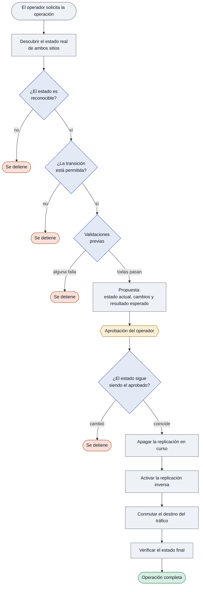

# Automatización de Failover — Kafka Activo/Pasivo

Automatiza en Ansible Automation Platform el procedimiento de **failover** entre los dos sitios
de un clúster Kafka activo/pasivo sobre OpenShift: invierte la replicación de MirrorMaker 2 y
conmuta el tráfico hacia el sitio que asume la operación.

La decisión de ejecutar un failover sigue siendo del operador. Lo que se automatiza es todo lo
demás: establecer el estado real, verificar que la operación sea posible, aplicarla en el orden
correcto y confirmar el resultado.

---

## Cómo opera



Dos propiedades sostienen el diseño:

**No se asume quién es el sitio activo.** Se descubre en cada ejecución, a partir de qué
MirrorMaker está replicando. Tras una rotación de roles los sitios quedan invertidos de forma
permanente, y la automatización lo refleja sin cambios de configuración.

**Ante un estado que no reconoce, se detiene.** No interpreta, no corrige, no improvisa. El
conjunto de transiciones válidas es explícito; cualquier combinación fuera de él interrumpe la
operación.

---

## Alcance

La unidad sobre la que opera es una **pareja**: dos clústeres Kafka en sitios opuestos, con sus
dos MirrorMaker y su proxy.

| | |
|---|---|
| **Implementado** | Failover de una pareja |
| **Previsto** | Failback, rotación programada de roles, y parejas adicionales |

Incorporar una pareja adicional es agregar un bloque de datos: la automatización no contiene
referencias a ninguna pareja en particular.

---

## Estructura

```
transitions.yml          contrato de transiciones permitidas
inventory/
  hosts.ini
playbooks/
  discover.yml           consulta el estado, sin modificar nada
  preflight.yml          valida la operación y arma la propuesta
  failover.yml           ejecuta y verifica
  group_vars/all/
    parejas.yml          definición de cada pareja
    umbrales.yml         tolerancias y tiempos de espera
roles/
  kafka_discover/        establece el estado real de ambos sitios
  kafka_decide/          valida contra el contrato; propone o verifica
  mm2_state/             modifica el estado de un MirrorMaker
  proxy_target/          conmuta el destino del tráfico
```

De los cuatro roles, **solo dos modifican el ambiente**. Los otros dos consultan y calculan.

---

## Configuración

Dos archivos concentran todo lo que cambia entre ambientes. Los roles no contienen nombres de
recursos ni rutas.

### `parejas.yml` — qué existe y dónde

Por cada pareja: los dos sitios con su API y namespace, los dos MirrorMaker con el sitio donde
reside cada uno, el proxy y sus destinos posibles, y la lista de tópicos de aplicación.

El MirrorMaker reside siempre en el sitio **destino** de la replicación, no en el origen.

### `transitions.yml` — qué está permitido

Por cada transición: el estado de partida, las validaciones exigidas, las acciones a aplicar y
el estado esperado al terminar. Una transición no declarada aquí no puede ejecutarse.

Es el documento que se revisa con arquitectura y con auditoría: describe el comportamiento
completo de la automatización sin leer código.

### `umbrales.yml` — tolerancias

Atraso de replicación admitido, tiempos de espera y condiciones de salud exigidas. Ajustables
por ambiente sin tocar la lógica.

---

## Validaciones previas

La transición declara cuáles exige. Si alguna falla, no se modifica nada.

| Validación | Qué exige |
|---|---|
| Sitio destino alcanzable | su API responde |
| Kafka destino operativo | el clúster reporta estado correcto |
| Sin particiones sub-replicadas | el destino está íntegro |
| Replicación al día | el atraso no supera el umbral configurado |
| Destino de tráfico resoluble | la configuración del proxy apunta a un destino válido |

La última evita el modo de falla más costoso: cortar el tráfico y descubrir después que el
destino no era alcanzable.

---

## Operación en AAP

El flujo se ejecuta como un workflow de tres pasos: **validación → aprobación → ejecución**.

El operador declara únicamente la intención — qué pareja y qué operación. **El sitio destino y
el escenario los determina la automatización**, y el operador los confirma al aprobar. Eso
elimina la posibilidad de ejecutar el escenario equivocado.

Antes de aprobar, el operador recibe el estado encontrado, los cambios que se aplicarán y el
resultado esperado.

El plan aprobado acompaña a la ejecución. Antes de modificar nada, la automatización vuelve a
establecer el estado y **comprueba que siga coincidiendo con lo aprobado**: si algo cambió entre
la aprobación y la ejecución, se detiene.

### Credenciales

Un tipo de credencial propio entrega a la automatización el acceso a cada sitio. Su creación
requiere privilegios de superusuario en la plataforma.

---

## Garantías

| | |
|---|---|
| Ante un estado desconocido | se detiene sin modificar nada |
| Ante una validación fallida | se detiene antes de la primera escritura |
| Si el estado cambió tras la aprobación | se detiene |
| Al invertir la replicación | apaga antes de activar, para no duplicar mensajes |
| Al conmutar el tráfico | verifica el destino antes de cortar el origen |
| Al terminar | confirma que el estado alcanzado es el declarado |

Toda modificación es un cambio de configuración declarativo y reversible. La automatización no
elimina ni recrea recursos.
